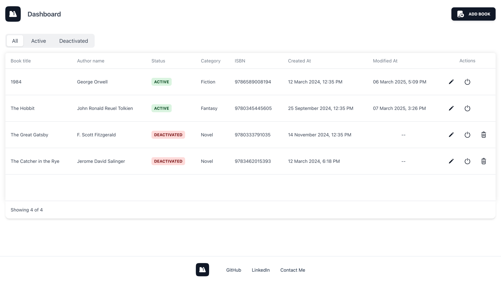

# Book List App

Demo Book List is a responsive CRUD application built with React that follows a REST architecture. The app allows users to manage a list of books, including creating, reading, updating, and deleting records. The interface consists of two main pages:
* Dashboard – Displays a list of books with filtering options.
* Add/Edit Book – A form for adding or updating book details.

The application ensures a user-friendly experience with a structured table layout, filtering options, automatic timestamps, and validation for input fields. It also maintains a clean UI with an intuitive design, supporting responsiveness for various screen sizes.

## Technologies Used
* Tailwind CSS
* React
* TypeScript
* Context API
* REST API
* React Router
* Luxon (for date and time formatting)
* JSON Server (for fake REST API)
* Vite

## Installation & Setup

Follow these steps to run the project locally:

    1. Open your terminal and run the following command to clone the repository:

        git clone https://github.com/modeltoIT/book-list-app.git

	2. Move into the project directory:
    
        cd book-list-app

	3. Ensure that Node.js version v20.x.x is installed. Verify this by running:
        
        node -v
        
        If the version is incorrect, install or update Node.js from Node.js official website.

	4. Install the necessary project dependencies by running:
        
        npm install

	5. Start the JSON Server (Fake REST API):

        npx json-server --watch db.json --port 5001
        
    
    6. Run the development server::

        npm run dev

## Preview

